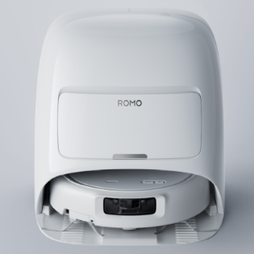

# DJI Romo Home Assistant Integration

Custom Home Assistant integration for the DJI Romo robot vacuum. It is designed as a HACS-compatible custom component and builds on the credential extraction work documented here:



- [xn0tsa/dji-home-credential-extractor](https://github.com/xn0tsa/dji-home-credential-extractor)

## What works today

- Config flow in Home Assistant
- Creates:
  - 1 vacuum entity
  - sensors for battery, firmware, dock state, tanks, consumables, cleaning solution, and settings
  - buttons for DJI Home cleaning shortcuts/presets
- Supports start, pause, stop, return to dock, and preset cleaning through DJI Home REST endpoints

## Install through HACS

1. Put this repository on GitHub.
2. In HACS, add it as a custom repository of type `Integration`.
3. Install `DJI Romo`.
4. Restart Home Assistant.
5. Add the integration from `Settings -> Devices & Services`.

## Getting credentials

Use the extractor project to retrieve the token and serial number:

1. Follow the instructions in [dji-home-credential-extractor](https://github.com/xn0tsa/dji-home-credential-extractor)
2. Add the Home Assistant integration
3. Paste the full `.env` or `dji_credentials.txt` output into the credentials field

The config flow will parse:

- `DJI_USER_TOKEN`
- `DJI_DEVICE_SN`
- `DJI_API_URL`
- `DJI_LOCALE`

You can still enter the token and serial manually if you prefer.

## Recommended first setup

1. Add the integration with only the token first.
2. Let it auto-discover the Romo serial number.
3. Confirm that battery/status telemetry starts updating.
4. Test `vacuum.start`, `vacuum.pause`, `vacuum.return_to_base`, or one of the preset buttons.

## Default MQTT topics

Subscriptions:

- `forward/cr800/thing/product/{device_sn}/#`
- `thing/product/{device_sn}/#`

Commands:

- `forward/cr800/thing/product/{device_sn}/services`

## Example command mapping

```json
{
  "locate": {
    "method": "find_robot"
  },
  "pause": {
    "method": "pause_clean"
  },
  "return_to_base": {
    "method": "back_charge"
  },
  "start": {
    "method": "start_clean"
  },
  "stop": {
    "method": "stop_clean"
  }
}
```

## Authentication notes

The permanent-looking DJI Home user token is extracted from the Android app. The integration uses it to request short-lived MQTT credentials automatically. If DJI invalidates the user token, Home Assistant will show a repair issue and start reauthentication; paste fresh extractor output to recover.

## Local control

The robot is visible on the LAN via mDNS, but current testing found no open TCP ports on the robot. Control currently uses DJI cloud REST for commands and DJI cloud MQTT for push telemetry.
